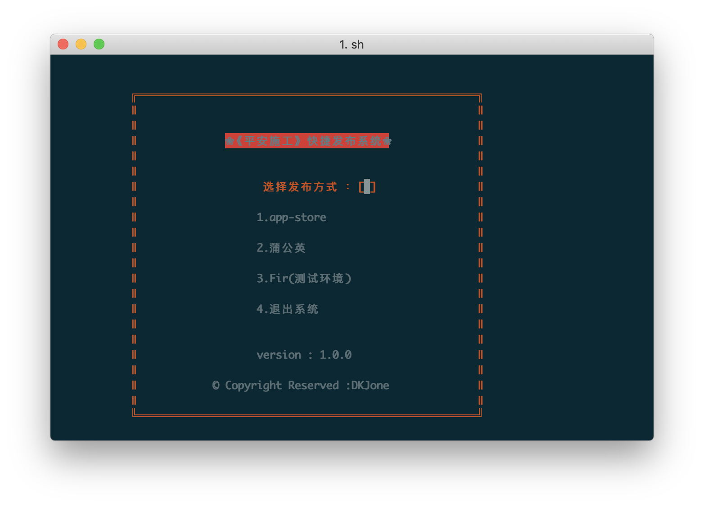

# 自动化打包脚本
#### 主要功能：
1. 自动修改项目配置文件（服务器地址切换）
2. 一键打包上传到app-store 
3. 一键发布到蒲公英（并打开结果页 可选）
4. 一键发布到Fir（并打开结果页 可选）


#### 使用方法：
1.下载本项目并将以下文件拷贝到你的项目文件夹下与你的XXX.xcproject或XXX.xcworkspace在同一文件加下
>archive.sh

>exportTest.plist

>exportAppstore.plist  

2.修改项目配置：
>（1）替换工程名称：  将第88行XXX替换成自己的工程名

>（2）替换scheme名   将第91行XXX替换成自己的sheme名(默认和工程名相同)

>（3）自动修改项目配置（本条可选,如不需要可跳过）

```sh
脚本中示例（136-138行）
sed -i '' '14c\
#define '${host}'\
' safeness/Common/APIDefine.h
```

以上脚本作用是修改 项目文件夹下 `safeness/Common/APIDefine.h`中的第14行为` #define 加上host的值`host根据用户不同输入在第117、121、126行分别进行了赋值

```sh
if [ $number == 4 ];then
	clear
	exit 0 
elif [ $number == 1 ];then
	development_mode=Release
	exportOptionsPlistPath=${project_path}/exportAppstore.plist
elif [ $number == 2 ];then
	host=ReleaseHost
	development_mode=Debug
	exportOptionsPlistPath=${project_path}/exportTest.plist
elif [ $number == 3 ];then
	host=DebugHost
	development_mode=Debug
	exportOptionsPlistPath=${project_path}/exportTest.plist
fi
```
APIDefine.h中已经定义了每个宏对应的服务器地址

```C
// 服务器地址选择 【ReleaseHost、TestHost、DebugHost】
#define ReleaseHost//这是第14行脚本会自动修改这一行代码

#if defined ReleaseHost
    #define BaseUrl @"http://127.0.0.1:6001" //生产环境
#elif defined TestHost
    #define BaseUrl @"http:`//127.0.0.1:8081" //开发环境 
#elif defined DebugHost
    #define BaseUrl @"http://127.0.0.1:7001" //测试环境
#endif
```
脚本中替换的逻辑已被注释如果需要使用需删除
131行 `:<<EOF`和139行`EOF`


>（4）修改App Store配置（可选）    将第200行和第201行 -u 后面的XXX替换成自己的AppleID的账号，-p后面的XXX替换成自己的密码 

>（5）修改蒲公英配置（可选） 将第208和209行  XXX换成你在蒲公英获取的`uKey` 和 `_api_key` 如果需要打开上传完成结果页需要自己修改第211行的上传完成的网页地址 

>（6）修改上传到Fir的配置(可选) 将第218行的XXX换成 你的fir的登录Token  如果需要打开上传完成结果页需要自己修改第220行的上传完成的网页地址 
注：如果需要使用fir需要安装fir-cli使用以下命令安装,如果权限不够再前面加上`sudo`

>`gem install fir-cli`

3 运行脚本 当终端处于任意目录下都可以运行本脚本，第一次需要给予脚本执行权限使用`chmod +x 脚本路径`例如:

```sh
chmod +x /myCode/svn/safeness/archive.sh
```
之后每次需要执行脚本可以直接将脚本拖入终端运行

```
 /myCode/svn/safeness/archive.sh
```

*编译时配置可以吸引改两个plist文件进行配置


